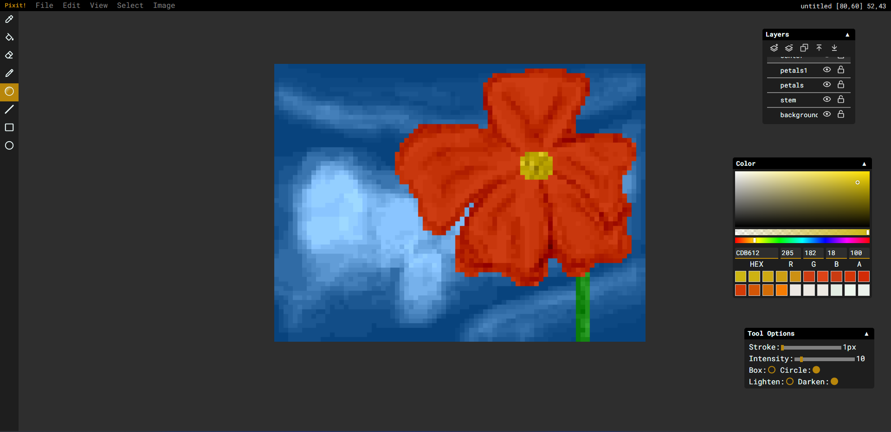

# Pixit!
Pixit! is a pixel art editor, built with React and Typescript. It let's you create and edit pixel art right in your favorite web browser.



# Local Setup
These are the instructions to get Pixit! to work locally on your system. You'll need node, npm and vite installed on your machine.

Then run these commands in a command shell

```
# clone the repo
git clone https://github.com/nyommm/pixit.git
cd pixit
# install dependencies
npm i
# start Pixit!
npm run dev
```

That's it!